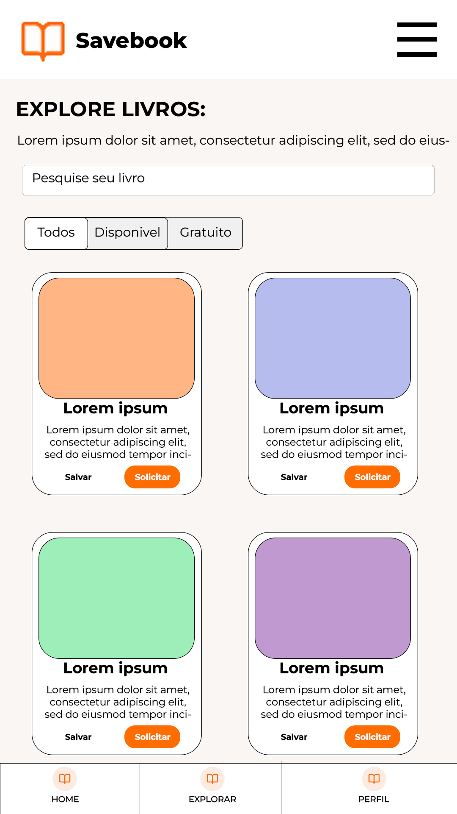
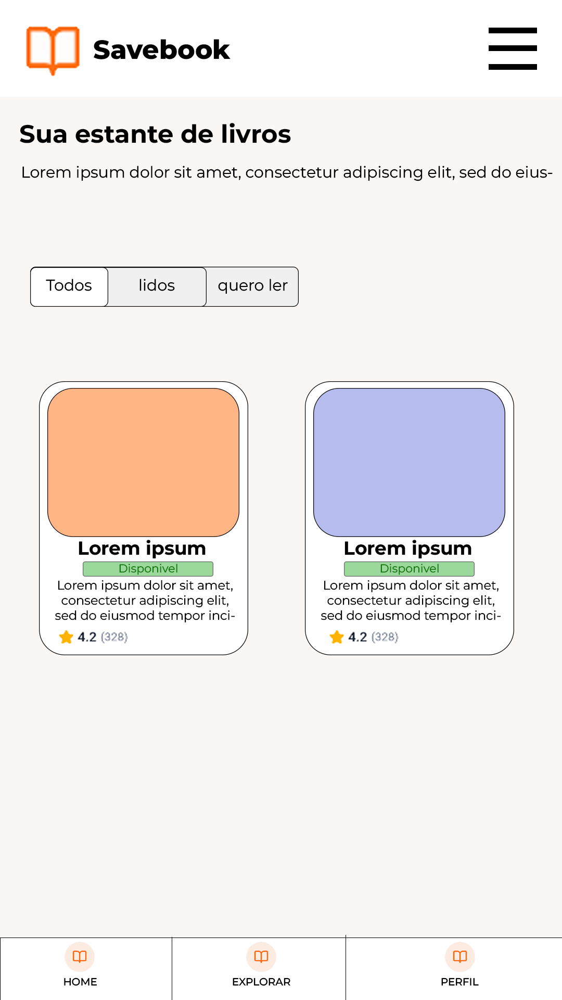
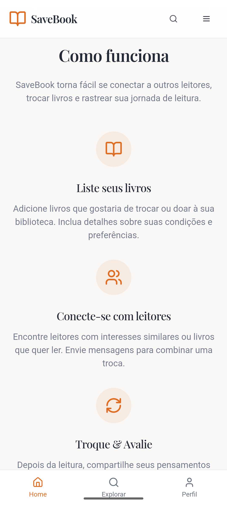
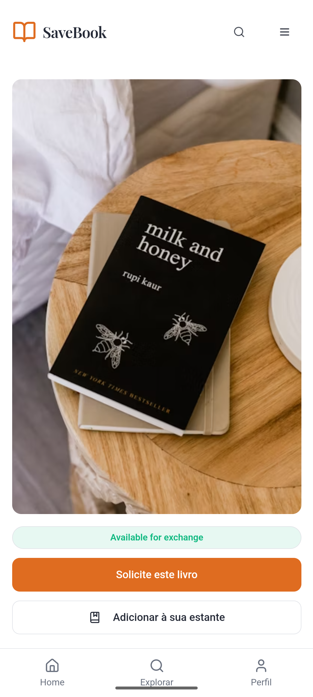
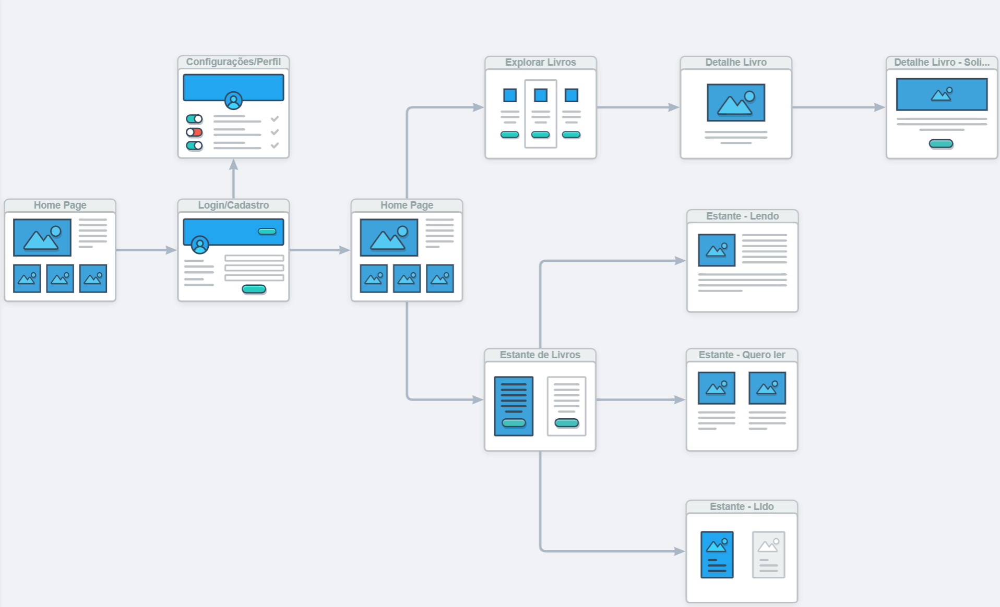

# Front-end Móvel

O projeto SaveBook é uma aplicação web e mobile que visa promover o hábito de leitura entre jovens de 15 a 35 anos, criando uma comunidade online para troca, doação e recomendação de livros. Seu objetivo é facilitar o acesso à literatura, superar barreiras econômicas e incentivar a interação social entre leitores, oferecendo funcionalidades como estante virtual, avaliações de livros, feed social e biblioteca de domínio público, tudo dentro de um ambiente intuitivo e dinâmico.

## Projeto da Interface
### Wireframes

Os Wireframes das páginas principais da interface foram desenvolvidos no software Photoshop. 

Homepage:  

Homepage²:  

Explorar livros: 

Estante: 

Detalhes de livros: 

Solicitar Livro: 

### Design Visual

A interface do SaveBook apresenta um design moderno e minimalista, priorizando a legibilidade e a usabilidade com uma aparência limpa e funcional. A paleta de cores combina tons quentes e neutros, utilizando laranja (#DF6C20) em elementos interativos, branco (#FFFFFF) nos fundos e cinzas suaves (#2A303D, #78808C). As fontes escolhidas são serifadas elegantes — Playfair Display e Literata — para títulos e nomes de livros, enquanto a fonte sans-serif Inter é aplicada aos textos, garantindo uma hierarquia visual bem definida.

Homepage:  

Fontes:
 Título destacado: Playfair Display
 Subtítulos/textos/depoimentos: Inter

Cores:
 Fundo: #F9F9F9
 Título: #2A303D
 Destaque: #DF6C20
 Textos: #78808C
 Logo: #E65100
 Depoimentos: #F1F1F1

 Homepage:  

Homepage²:  

Explorar:  

Fontes:
 Título: Playfair Display
 Subtítulo: Inter
 Títulos livros: Literata
 Autores: Inter

Cores:
 Fundo: #FFFFFF
 Título: #2A303D
 Subtítulo: #78808C
 Filtros: #DEE2E8
 Botões: #DF6C20
 Estrelas: #FFD700
 Cards: #FFFFFF

Explorar:  

Detalhes Livro:  

Fontes:
 Título: Playfair Display
 Textos: Inter

Cores:
 Fundo: #FFFFFF
 Título: #2A303D
 Textos: #78808C
 Botão: #DF6C20
 Cancelar: #DEE2E8

Detalhes livro:  

Detalhes livro²:  

## Fluxo de Dados

## Tecnologias Utilizadas

* React Native: Biblioteca JavaScript para criar interfaces de usuário (UI), utilizando componentes reutilizáveis e buscando interatividade.

* TypeScript: Superset do JavaScript que adiciona tipagem estática ao código, ajudando a evitar erros e facilitando a manutenção de projetos.

* Android Studio: IDE para desenvolvimento mobile.

## Considerações de Segurança

As principais considerações de segurança no front-end da aplicação SaveBook incluem:

* Proteção de Dados em Trânsito: Todo o tráfego entre cliente e servidor é protegido via HTTPS, garantindo a criptografia dos dados trocados e prevenindo ataques de interceptação (como o man-in-the-middle).

* Gerenciamento Seguro de Tokens: Os tokens de autenticação (JWT) são armazenados em memória volátil ou cookies com atributos de segurança (HttpOnly, Secure, SameSite) para reduzir o risco de vazamento por XSS ou CSRF.

* Prevenção contra XSS (Cross-Site Scripting): Dados exibidos na interface passam por processos de sanitização e escape para evitar a injeção de scripts maliciosos que comprometam a segurança do usuário.

* Segurança na Comunicação com APIs: O front-end realiza chamadas apenas para APIs autorizadas e confiáveis, sempre enviando os tokens de autenticação e validando respostas, reduzindo riscos de falsificação ou redirecionamento.

* Atualizações e Dependências Seguras: As bibliotecas e frameworks (como React, Vite, Tailwind) são mantidos atualizados, e ferramentas como dependabot são utilizadas para detectar vulnerabilidades conhecidas.

Essas práticas garantem que a experiência do usuário no front-end seja segura, protegendo dados e prevenindo interações maliciosas com a aplicação.

## Implantação

A aplicação SAVEBOOK foi implantada seguindo práticas modernas de desenvolvimento distribuído, utilizando ferramentas gratuitas, escaláveis e integradas ao fluxo de desenvolvimento.

### Requisitos de Hardware e Software

* Node.js versão 18 ou superior
* Git
* Conta no Vercel
* Conta no MongoDB Atlas
* Firebase Authentication e Firebase Cloud Messaging
* CPU: mínimo 2 vCPUs
* Memória RAM: 4 GB
* Armazenamento: SSD de 40 GB
* Conectividade: no mínimo 100 Mbps

### Plataforma de Hospedagem

* Frontend: Vercel (React)
* Backend: Vercel (Node.js + Express, serverless)
* Banco de dados: MongoDB Atlas (NoSQL, em nuvem)
* Autenticação: Firebase Authentication
* Notificações: Firebase Cloud Messaging

### Configuração do Ambiente

* Repositórios frontend e backend criados no GitHub
* Instalação das dependências com `npm install`
* Scripts definidos no `package.json`:

  * "start": "node index.js"
  * "build": "vite build"
* Variáveis de ambiente configuradas no painel do Vercel:

  * MONGO\_URI
  * JWT\_SECRET
  * FIREBASE\_API\_KEY
* Integração contínua com GitHub, ativando deploy automático a cada commit na branch main

### Processo de Deploy

O deploy foi realizado via integração entre GitHub e Vercel. A cada push na branch main, o Vercel executa a build automaticamente e publica a nova versão. O banco de dados é acessado via URI segura do MongoDB Atlas. Firebase é utilizado para autenticação de usuários e envio de notificações.

### Validação Pós-Deploy

* Testes de autenticação com Firebase (login via Google e Facebook)
* CRUD completo de usuários e livros validado com Swagger
* Verificação de responsividade da interface web em dispositivos desktop e mobile
* Testes de envio e recebimento de notificações via Firebase Cloud Messaging
* Testes de leitura e escrita no MongoDB Atlas

A aplicação apresentou funcionamento estável e desempenho satisfatório em ambiente de produção.

## Testes

# Estratégia de Testes – SAVEBOOK

A estratégia de testes foi baseada nos requisitos funcionais definidos na Etapa 2. Foram aplicadas abordagens complementares para validar o correto funcionamento da aplicação, tanto em nível de código quanto em sua integração com o ambiente de produção.

## Casos de Teste por Requisito Funcional

| Requisito | Descrição                                                                 | Evidência em Vídeo                              |
|-----------|---------------------------------------------------------------------------|--------------------------------------------------|
| RF-001    | Cadastro e login de usuários com e-mail e redes sociais                  | [https://streamable.com/1gzoju](https://streamable.com/1gzoju) |
| RF-002    | Cadastro de livros com título, autor, edição, estado de conservação e imagem | [https://streamable.com/4h4y82](https://streamable.com/4h4y82) |
| RF-003    | Manifestar interesse em livros cadastrados para troca                    | [https://streamable.com/plyylz](https://streamable.com/plyylz) |
| RF-004    | Estante virtual: registrar livros lidos, em leitura e desejados          | [https://streamable.com/u8rro4](https://streamable.com/u8rro4) |
| RF-005    | Avaliação de livros com notas e comentários                              | [https://streamable.com/3p072e](https://streamable.com/3p072e) |
| RF-009    | Publicação de resenhas no feed, com curtidas e comentários               | [https://streamable.com/87swu5](https://streamable.com/87swu5) |

## Resultados Obtidos

- Todos os requisitos classificados como "Must Have" foram testados com sucesso.
- Tempo médio de resposta dos endpoints: inferior a 1.5 segundos.
- Nenhum erro crítico foi identificado nos testes de integração.
- Funcionalidades de autenticação e notificações operaram conforme o esperado.
- Todos os testes foram documentados em vídeo para facilitar a validação externa.
- A aplicação SAVEBOOK demonstrou estabilidade e confiabilidade nos fluxos principais.

# Referências

  BARBOSA, A. F.; LIMA, P. G.. O aumento do preço dos livros e o impacto no acesso à leitura no Brasil. São Paulo: Editora Cultura, 2020.

 GOMES, M. C.; SILVA, T. P. Plataformas digitais e a transformação do hábito de leitura entre jovens. Rio de Janeiro: Editora Educação, 2021.

 Retratos da Leitura no Brasil. Instituto Pró Livro. Ministério da Cultura, 2024. Disponível em: https://www.prolivro.org.br/wp-content/uploads/2024/11/Apresentac%CC%A7a%CC%83o_Retratos_da_Leitura_2024_13-11_SITE.pdf. Acesso em: 18 fev. 2025.

 BEZERRA, Raphael. Mais da metade dos jovens brasileiros tem pouco ou nenhum hábito de leitura e é desafio para educação. Jornal Opção, 24 jul. 2024. Disponível em: Mais da metade dos jovens brasileiros tem pouco ou nenhum hábito de leitura e é desafio para educação. Acesso em: 19 fev. 2025.

 Relatório Jovens na Ibero-América 2021: 67% dos jovens brasileiros afirmam gostar de ler, mas leem apenas dois livros em média por ano. Instituto Pró Livro, 24 out. 2022. Disponível em: https://www.prolivro.org.br/2022/10/24/relatorio-jovens-na-ibero-america-2021-67-dos-jovens-brasileiros-afirmam-gostar-de-ler-mas-leem-apenas-dois-livros-em-media-por-ano/. Acesso em: 20 fev. 2025.

 OLIVEIRA, A. F.; MENDES, R. P. A leitura entre os jovens: desafios e soluções para o acesso aos livros. São Paulo: Editora Cultura, 2023.

 INSTITUTO PRÓ LIVRO. Retratos da Leitura no Brasil 2024. São Paulo: Instituto Pró Livro, 2024.

