# Front-end Web

O projeto SaveBook é uma aplicação web e mobile que visa promover o hábito de leitura entre jovens de 15 a 35 anos, criando uma comunidade online para troca, doação e recomendação de livros. Seu objetivo é facilitar o acesso à literatura, superar barreiras econômicas e incentivar a interação social entre leitores, oferecendo funcionalidades como estante virtual, avaliações de livros, feed social e biblioteca de domínio público, tudo dentro de um ambiente intuitivo e dinâmico.

## Projeto da Interface Web
### Wireframes

Os Wireframes das páginas principais da interface foram desenvolvidos na plataforma Figma.

Homepage:  
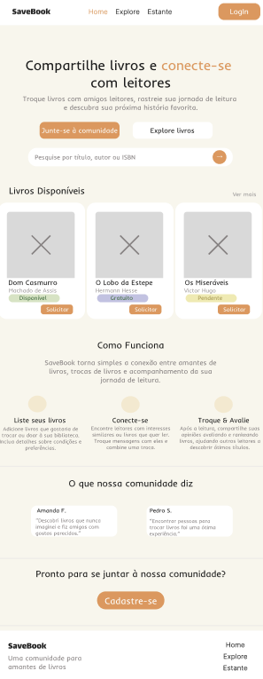

Explorar livros: 
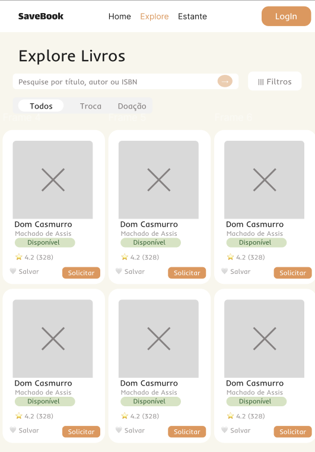

Estante: 
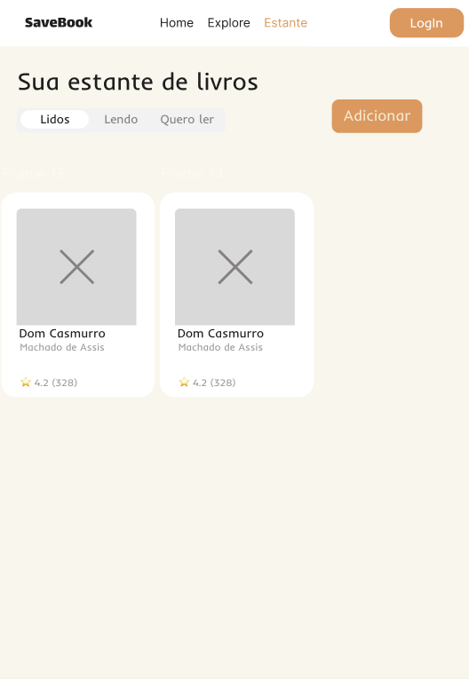

Detalhes de livros: 
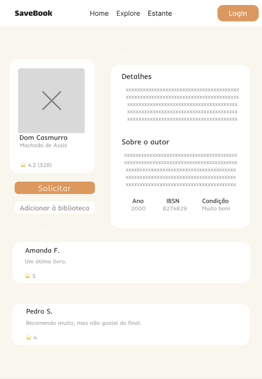

### Design Visual

 A interface do SaveBook é moderna e minimalista, com design limpo e funcional, focando em legibilidade e usabilidade. Usa uma paleta de cores quentes e neutras, com laranja (#DF6C20) em elementos interativos, fundos brancos (#FFFFFF) e cinzas suaves (#2A303D, #78808C). Combina fontes serifadas elegantes (Playfair Display e Literata) para títulos e livros, e a sans-serif Inter para textos, garantindo uma hierarquia visual clara.

HOMEPAGE:

Fontes:
 Título destacado: Playfair Display
 Subtítulos/textos/depoimentos: Inter

Cores:
 Fundo: #F9F9F9
 Título: #2A303D
 Destaque: #DF6C20
 Textos: #78808C
 Logo: #E65100
 Depoimentos: #F1F1F1

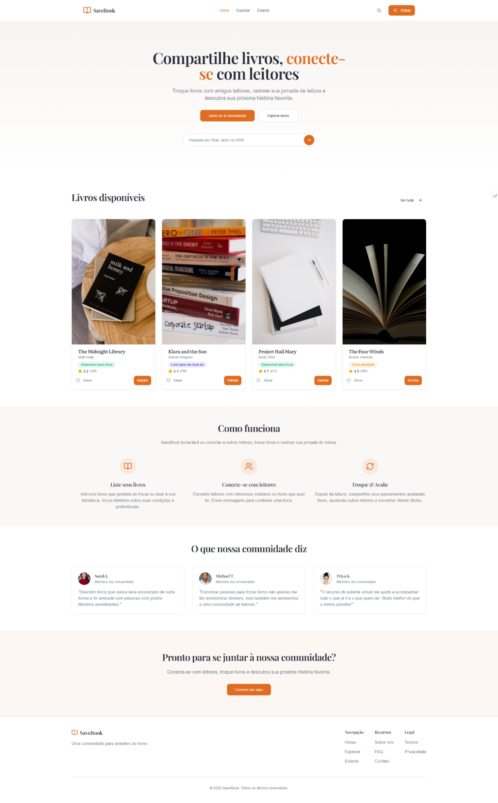
 
EXPLORAR:

Fontes:
 Título: Playfair Display
 Subtítulo: Inter
 Títulos livros: Literata
 Autores: Inter

Cores:
 Fundo: #FFFFFF
 Título: #2A303D
 Subtítulo: #78808C
 Filtros: #DEE2E8
 Botões: #DF6C20
 Estrelas: #FFD700
 Cards: #FFFFFF

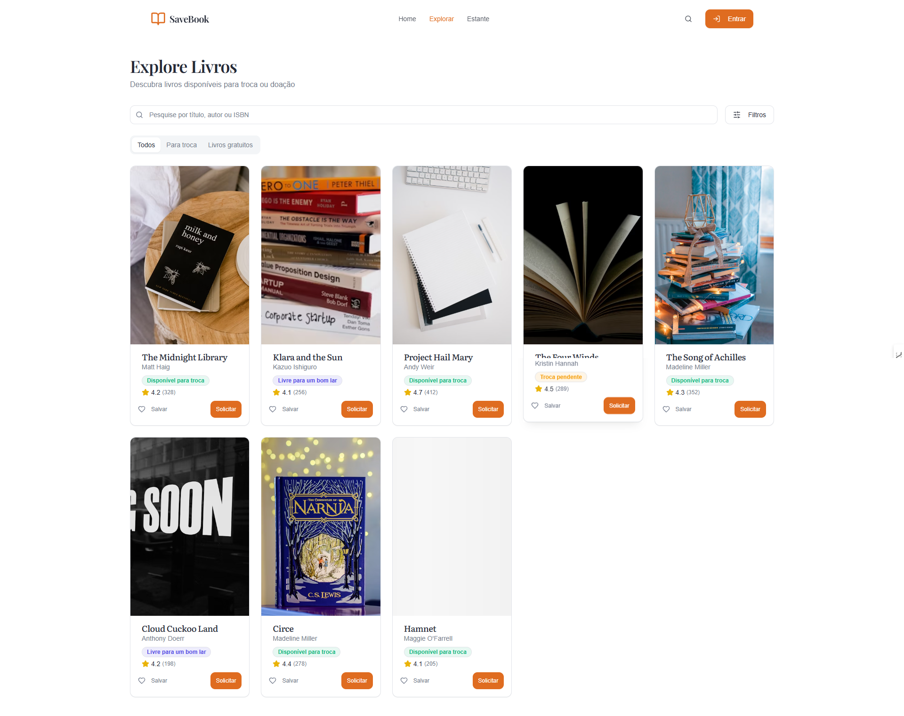

ESTANTE (LENDO)

Fontes:
 Título: Playfair Display
 Subtítulo: Inter
 Títulos livros: Literata
 Autores: Inter

Cores:
 Fundo: #FFFFFF
 Título: #2A303D
 Subtítulo: #78808C
 Abas: #DEE2E8
 Botão: #DF6C20
 Estrelas: #FFD700

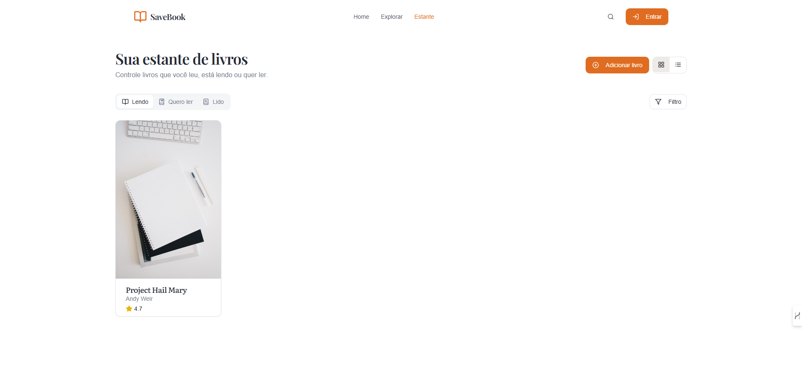

ESTANTE (QUERO LER):

Fontes:
 Título: Playfair Display
 Subtítulo: Inter
 Títulos livros: Literata
 Autores: Inter
Cores:
 Fundo: #FFFFFF
 Título: #2A303D
 Subtítulo: #78808C
 Abas: #DEE2E8
 Botão: #DF6C20
 Estrelas: #FFD700

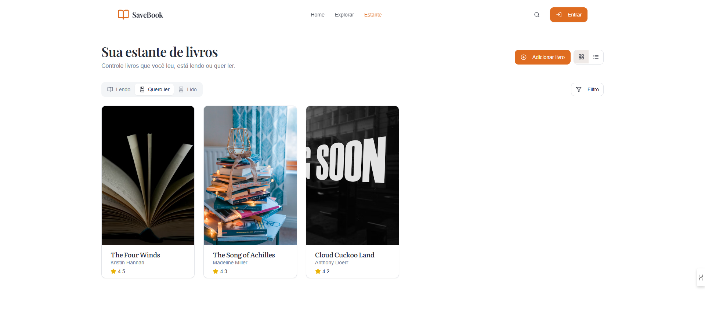

ESTANTE (LIDO):

Fontes:
 Título: Playfair Display
 Subtítulo: Inter
 Títulos livros: Literata
 Autores: Inter

Cores:
 Fundo: #FFFFFF
 Título: #2A303D
 Subtítulo: #78808C
 Abas: #DEE2E8
 Botão: #DF6C20
 Estrelas: #FFD700

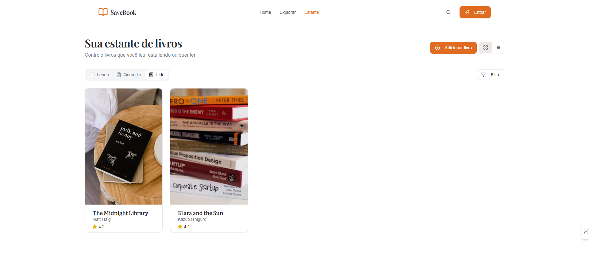

LOGIN/INSCREVER-SE:

Fontes:
 Títulos: Playfair Display
 Textos/links: Inter

Cores:
 Fundo: #FFFFFF
 Títulos: #2A303D
 Labels/links: #78808C
 Botões: #DF6C20
 Borda botão: #F0E2D7
 Link "Esqueceu?": #78808C

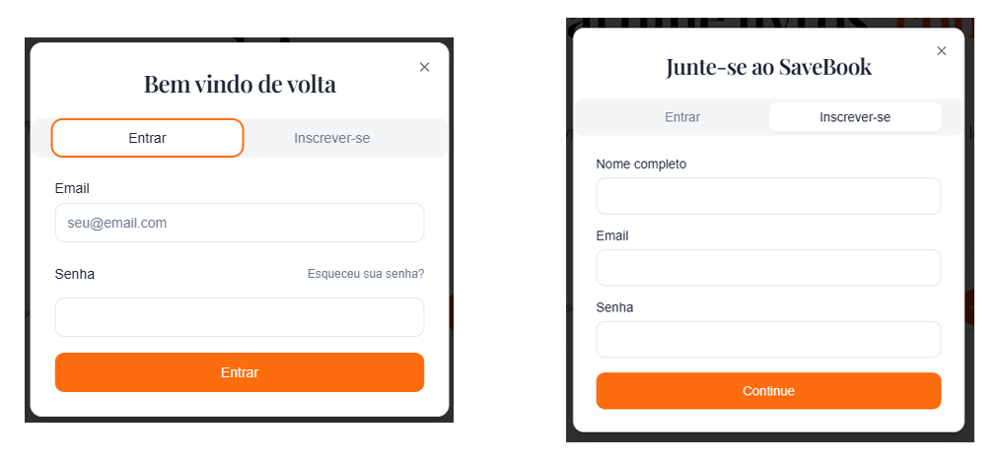

DETALHES LIVRO:

Fontes:
 Título livro: Literata
 Info/reviews: Inter

Cores:
 Fundo: #FFFFFF
 Título: #2A303D
 Textos: #78808C
 Botão: #DF6C20
 Disponível: #A8D5BA
 Estrelas: #FFD700
 Reviews: #F1F1F1

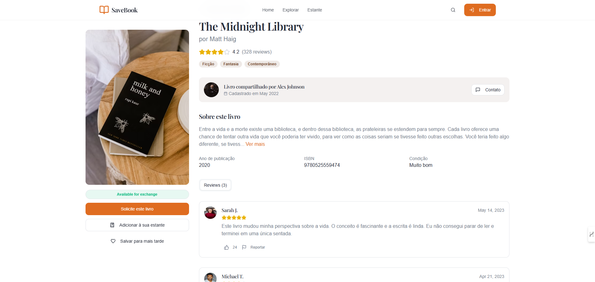

DETALHES LIVRO(SOLICITAR UM LIVRO):

Fontes:
 Título: Playfair Display
 Textos: Inter

Cores:
 Fundo: #FFFFFF
 Título: #2A303D
 Textos: #78808C
 Botão: #DF6C20
 Cancelar: #DEE2E8

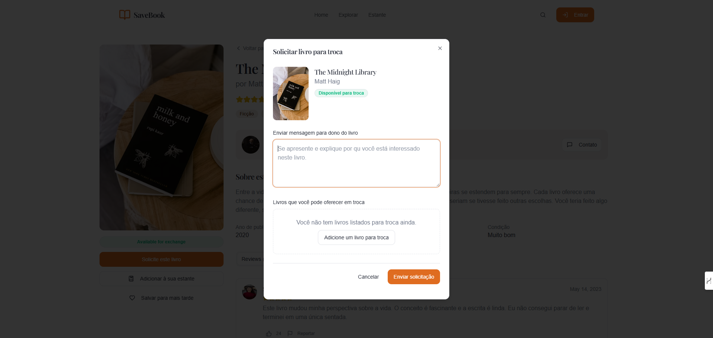

## Fluxo de Dados

## Tecnologias Utilizadas

* Vite: Ferramenta de build e desenvolvimento front-end, é uma ferramenta ágil e se caracteriza por ter recarregamento. 

* React: Biblioteca JavaScript para criar interfaces de usuário (UI), utilizando componentes reutilizáveis e buscando interatividade.

* TypeScript: Superset do JavaScript que adiciona tipagem estática ao código, ajudando a evitar erros e facilitando a manutenção de projetos.

* HTML: Linguagem de marcação usada para estruturar o conteúdo de páginas web (textos, imagens, links, etc.).

* CSS: Linguagem usada para definir o estilo visual de páginas web (cores, tamanhos, layouts, animações, etc.).

* Tailwind: Framework CSS utilitário que facilita a criação de interfaces com classes pré-definidas, agilizando o desenvolvimento. 

## Considerações de Segurança

As principais considerações de segurança no front-end da aplicação SaveBook incluem:

* Proteção de Dados em Trânsito: Todo o tráfego entre cliente e servidor é protegido via HTTPS, garantindo a criptografia dos dados trocados e prevenindo ataques de interceptação (como o man-in-the-middle).

* Gerenciamento Seguro de Tokens: Os tokens de autenticação (JWT) são armazenados em memória volátil ou cookies com atributos de segurança (HttpOnly, Secure, SameSite) para reduzir o risco de vazamento por XSS ou CSRF.

* Prevenção contra XSS (Cross-Site Scripting): Dados exibidos na interface passam por processos de sanitização e escape para evitar a injeção de scripts maliciosos que comprometam a segurança do usuário.

* Segurança na Comunicação com APIs: O front-end realiza chamadas apenas para APIs autorizadas e confiáveis, sempre enviando os tokens de autenticação e validando respostas, reduzindo riscos de falsificação ou redirecionamento.

* Atualizações e Dependências Seguras: As bibliotecas e frameworks (como React, Vite, Tailwind) são mantidos atualizados, e ferramentas como dependabot são utilizadas para detectar vulnerabilidades conhecidas.

Essas práticas garantem que a experiência do usuário no front-end seja segura, protegendo dados e prevenindo interações maliciosas com a aplicação.

## Implantação

A aplicação foi implantada utilizando a plataforma Vercel, aproveitando sua integração contínua com o GitHub e suporte para aplicações baseadas em React, garantindo uma experiência fluida de deploy.

Etapas de implantação:

- Requisitos de Software:
  - Node.js ≥ 18
  - Git
  - Conta no Vercel

- Configuração do Ambiente:
  - Criação de repositórios no GitHub com as versões do frontend (React) e backend (Node.js + Express).
  - Definição de variáveis de ambiente no painel do Vercel, como URIs do banco de dados, chaves de autenticação e tokens secretos.
  - Instalação de dependências com `npm install` em ambos os projetos.
  - Configuração de `build` e `start` scripts no `package.json`.

- Deploy:
  - O frontend foi implantado diretamente via Vercel, com cada push para a branch principal acionando automaticamente um novo deploy.

- Testes de Produção:
  - Após o deploy, foram realizados testes para verificar o funcionamento dos endpoints e da interface web.
  - Verificações incluíram autenticação, CRUD de usuários e livros, testes de responsividade e envio de notificações.

## Testes

 A estratégia de testes da aplicação SAVEBOOK foi desenvolvida com base nos requisitos funcionais RF-001 a RF-008. Foram elaborados casos de teste com objetivo, passos, resultado esperado e evidência registrada em vídeo (via Streamable), validando funcionalidades como cadastro de usuário, avaliação de livros, exibição de rankings e acesso à biblioteca digital.

 Os testes unitários foram executados manualmente em elementos específicos da interface, como campos de formulário e funções básicas, garantindo o comportamento esperado de unidades isoladas, mesmo sem o uso de frameworks automatizados como Jest.

 Os testes de integração foram conduzidos manualmente, verificando a comunicação entre o front-end e o back-end. Isso incluiu ações como envio de dados ao banco, retorno de avaliações e renderização dinâmica de informações nas páginas do usuário.

 Quanto aos testes de carga, foi realizada uma simulação de uso com múltiplas abas e navegadores abertos simultaneamente. Essa abordagem permitiu observar o desempenho da aplicação em situações de uso intensivo, mesmo sem a utilização de ferramentas como Artillery ou k6.

 As ferramentas utilizadas no processo de teste incluíram o Streamable para armazenamento e compartilhamento de vídeos, navegadores como Google Chrome e Microsoft Edge para execução dos testes, e o DevTools para inspeção de rede e análise das respostas da API.

Teste 01 RF-001– Cadastro de Usuário 
 Objetivo: Validar o cadastro de novo usuário com nome, e-mail e senha.
 Passos:
- Acessar a página de cadastro (/signup).
- Preencher nome, e-mail e senha válidos.
- Clicar em 'Cadastrar'.
Resultado Esperado: Usuário é redirecionado para a página principal sem mensagens de erro e o email é cadastrado no banco de dados.
Evidência:

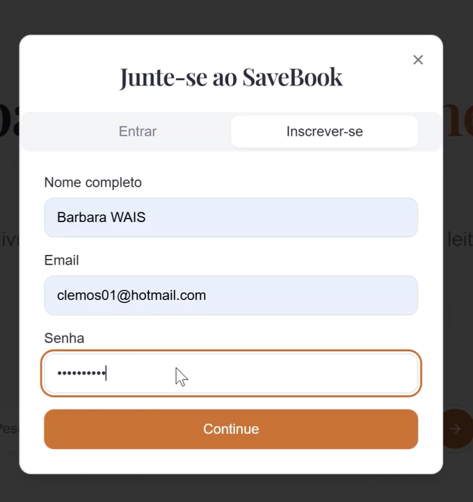

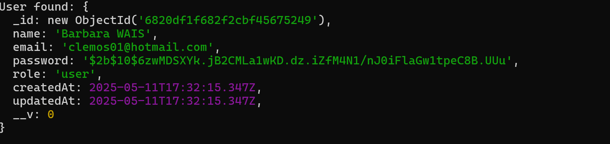
https://streamable.com/1gzoju

Teste 02 RF-005–Avaliação de Livro (Nota e Comentário).	
Objetivo: Testar o sistema de avaliações.
Passos:
- Acessar os detalhes de um livro.
- Verificar nota e comentário.
Resultado Esperado: Avaliação aparece listada na página do livro.
Evidência: 
https://streamable.com/3p072e

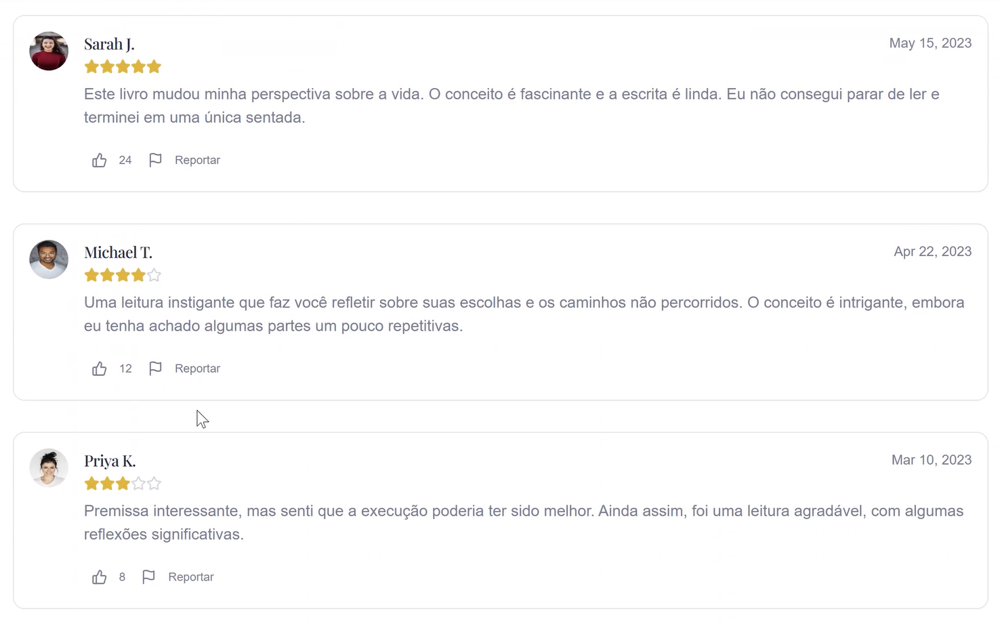

Teste 03 RF-006–Ranking de Livros
 Objetivo: Verificar o envio de solicitação de troca de livro.
Passos:
- Acessar a aba ou seção de ranking.
- Observar a ordenação por média de notas.
Resultado Esperado: Livros exibidos em ordem decrescente de avaliação.
Evidência: 
https://streamable.com/jwraz1

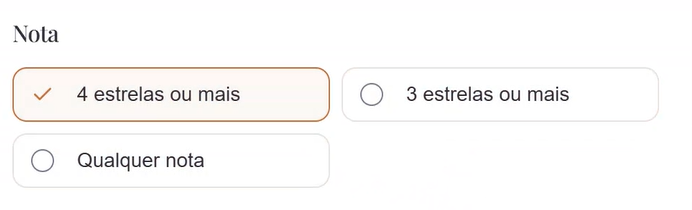
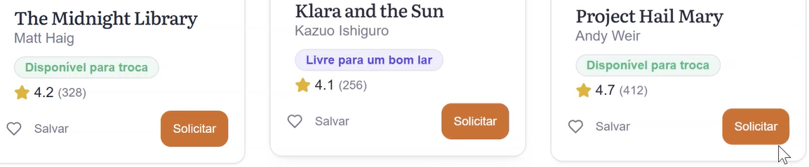

Teste 04 RF-008– Acessar livros gratuitos
Objetivo: Acessar livros gratuitos para leitura ou download.
Passos:
- Acessar aba “Biblioteca Digital”.
- Usar filtros por autor, gênero ou data.
Resultado Esperado: Livros disponíveis para leitura ou download gratuito.
Evidência:
https://streamable.com/p0zg8m

1. Casos de Teste para Requisitos Funcionais e Não Funcionais

Foram criados testes funcionais com base nos requisitos RF-001 a RF-008, cobrindo cadastro de usuário, avaliação, ranking e acesso à biblioteca. As evidências foram registradas em vídeo. Aspectos não funcionais como usabilidade e navegação fluida foram demonstrados no vídeo geral da aplicação.

2. Testes Unitários

Não foram utilizados frameworks como Jest, mas testes manuais foram realizados em funções isoladas da interface, como validação de formulários e filtros. Esses testes simulam o comportamento esperado de testes unitários.

3. Testes de Integração

As funcionalidades foram testadas em conjunto: o front-end interagiu com a API corretamente em cadastros, avaliações e buscas. Os testes foram feitos manualmente e comprovados por vídeo.

4. Testes de Carga

Foram feitas simulações manuais em diferentes abas e navegadores para avaliar estabilidade e tempo de resposta da aplicação. Não foram usados scripts automatizados.

5. Ferramentas Utilizadas

Streamable – Gravação e compartilhamento das evidências de teste.

Navegadores (Chrome/Edge) – Execução dos testes manuais.

DevTools – Verificação de respostas da API.

# Referências

  BARBOSA, A. F.; LIMA, P. G.. O aumento do preço dos livros e o impacto no acesso à leitura no Brasil. São Paulo: Editora Cultura, 2020.

 GOMES, M. C.; SILVA, T. P. Plataformas digitais e a transformação do hábito de leitura entre jovens. Rio de Janeiro: Editora Educação, 2021.

 Retratos da Leitura no Brasil. Instituto Pró Livro. Ministério da Cultura, 2024. Disponível em: https://www.prolivro.org.br/wp-content/uploads/2024/11/Apresentac%CC%A7a%CC%83o_Retratos_da_Leitura_2024_13-11_SITE.pdf. Acesso em: 18 fev. 2025.

 BEZERRA, Raphael. Mais da metade dos jovens brasileiros tem pouco ou nenhum hábito de leitura e é desafio para educação. Jornal Opção, 24 jul. 2024. Disponível em: Mais da metade dos jovens brasileiros tem pouco ou nenhum hábito de leitura e é desafio para educação. Acesso em: 19 fev. 2025.

 Relatório Jovens na Ibero-América 2021: 67% dos jovens brasileiros afirmam gostar de ler, mas leem apenas dois livros em média por ano. Instituto Pró Livro, 24 out. 2022. Disponível em: https://www.prolivro.org.br/2022/10/24/relatorio-jovens-na-ibero-america-2021-67-dos-jovens-brasileiros-afirmam-gostar-de-ler-mas-leem-apenas-dois-livros-em-media-por-ano/. Acesso em: 20 fev. 2025.

 OLIVEIRA, A. F.; MENDES, R. P. A leitura entre os jovens: desafios e soluções para o acesso aos livros. São Paulo: Editora Cultura, 2023.

 INSTITUTO PRÓ LIVRO. Retratos da Leitura no Brasil 2024. São Paulo: Instituto Pró Livro, 2024.

